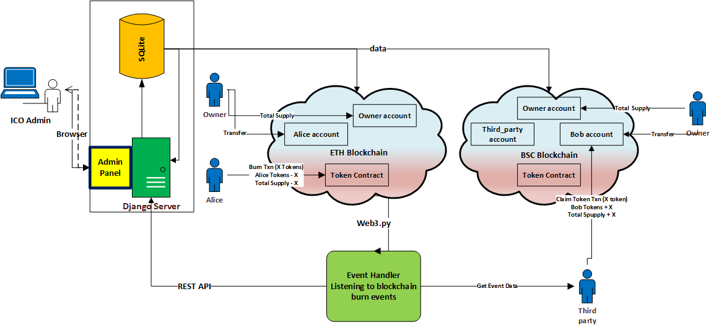

# Cross-Blockchain-Token-Transfer

## Overview

## Architecture

  

## Prerequisites

- Install [Python 3.11](https://www.python.org/downloads/)

- Install [Ganache](https://trufflesuite.com/ganache/). It can also be installed via [NPM](https://docs.nethereum.com/en/latest/ethereum-and-clients/ganache-cli/)

### Set virtual environment

`py -3.11 -m venv venv`

`.\venv\Scripts\activate`

### Install Requirements

`pip install -r requirements.txt`

### Django Server

`cd cross_token`

`python manage.py makemigrations core`

`python manage.py migrate`

If you get an error, delete the `migrations` folder and `db.sqlite3` and repeat these steps again.

## Run

Run two ganache instances.
- run ganache on `localhost:7545`
- run the command prompt as an administrator
`ganache-cli -p 8545 --verbose`

- run Django server:

`cd cross_token`

`python manage.py runserver`

-Run event handler

